<div align="center">

# Autonomous Acoustic Inspection Robot (AAIR)

### 협소·위험 구역 자율순찰 이상음 감지 로봇

TurtleBot3가 지정 구역을 자율 순찰하고 설비음을 수집·분석하여<br />
정상·이상 상태를 판정하고 현장에 알리는 산업 점검 로봇 프로젝트

<p>
  
  
  
  
  
</p>

<a href="https://www.youtube.com/watch?v=Mjf2t31ZWa0">
  
</a>

</div>

---

## Contributors

<div align="center">
  <table width="100%">
    <tr>
      <td align="center" width="25%">
        <a href="https://github.com/kakabab12">
          <br />
          <sub><b>이지용</b></sub>
        </a><br />
        VISION
      </td>
      <td align="center" width="25%">
        <a href="https://github.com/Combatroad">
          <br />
          <sub><b>은대영</b></sub>
        </a><br />
        AUDIO
      </td>
      <td align="center" width="25%">
        <a href="https://github.com/Hohojae7">
          <br />
          <sub><b>장재호</b></sub>
        </a><br />
        NAVIGATION
      </td>
      <td align="center" width="25%">
        <a href="https://github.com/hanmin0309">
          <br />
          <sub><b>김한민</b></sub>
        </a><br />
        EMBEDDED
      </td>
    </tr>
  </table>
</div>

---

## 1. 프로젝트 소개

> AAIR는 TurtleBot3가 협소·위험 구역을 자율 순찰하며 설비음을 수집·분석하고, 정상·이상 상태를 현장에 알리는 산업 점검 로봇입니다.<br />
> 자율순찰과 작업자 수동 개입을 하나의 운용 흐름으로 연결해, 사람이 현장에 들어가기 전 반복 가능한 1차 점검을 수행합니다.

<table>
  <tr>
    <td>
      다음과 같은 문제를 대상으로 합니다.
      <br /><br />
      - 협소·위험 구역을 작업자가 반복해서 직접 점검해야 하는 문제<br />
      - 작업자마다 순찰·점검 절차가 달라져 일관성을 유지하기 어려운 문제<br />
      - 고소음 환경에서 청감만으로 설비 이상 여부를 일관되게 판단하기 어려운 문제<br />
      - 좁은 통로와 자율주행 예외 상황에서 자동 운용만으로 대응하기 어려운 문제
    </td>
  </tr>
</table>

---

## 2. 프로젝트 목표

- 협소·위험 구역의 반복적인 1차 점검을 이동 로봇 기반 자율순찰로 수행
- 지정 경로 순찰과 동일한 음향 처리 과정을 적용해 반복 가능한 점검 절차 구현
- 자율순찰이 어려운 구간에서 제스처 또는 IMU 장갑으로 수동 제어한 뒤 자율주행 복귀
- 설비음의 정상·이상 상태를 판정하고 ROS 2 Terminal 및 Green/Red LED로 결과 출력
- 센서 입력, 이동 제어, 음향 판정, 상태 출력을 ROS 2 기반 하나의 운용 흐름으로 통합

---

## 3. 주요 기능

| 구분 | 주요 내용 |
| --- | --- |
| **3-1. 자율순찰** | **지도 생성 및 위치 추정**: SLAM Toolbox로 지도를 생성하고 AMCL로 현재 위치를 추정<br />**Waypoint 주행**: Nav2 `FollowWaypoints`와 `NavigateToPose`를 이용해 지정 경로를 순찰<br />**순찰 복귀**: 최종 시나리오 기준 A-B-C-D-A 구간의 이동과 제어권 전환 수행 |
| **3-2. 음향 이상 감지** | **실시간 음향 입력**: Webcam 내장 마이크의 입력을 연속 수집하여 일정 구간 단위로 처리<br />**특징 추출 및 분류**: 설비음에서 MFCC 특징을 계산하고 SVM으로 `NORMAL`과 `ABNORMAL` 분류<br />**상태 발행**: 이상 확률과 판정 상태를 ROS 2 Topic으로 발행 |
| **3-3. 결과 확인 및 경고** | **현장 표시**: 정상 상태는 Green LED, 이상 상태는 Red LED로 구분<br />**상태 확인**: ROS 2 Terminal Log와 Topic을 통해 판정 상태와 이상 확률 확인<br />**위치 확인**: RViz2에서 지도, 로봇 위치, 이동 경로 확인 |
| **3-4. 수동 보조제어** | **손 제스처 제어**: MediaPipe Hand Landmarker의 손 랜드마크를 제어 명령으로 변환<br />**IMU 장갑 제어**: ESP32와 MPU6050이 측정한 손목의 Roll·Pitch를 Wi-Fi UDP로 전송<br />**조이스틱 지원**: 컨트롤러 모드에서 조이스틱과 IMU 장갑 입력을 선택적으로 사용 |
| **3-5. 통합 운용** | **AUTO/MANUAL 전환**: 자율순찰 중 작업자 개입이 필요한 구간에서 제어권 전환<br />**속도 명령 통합**: Nav2, 제스처, 조이스틱, 장갑의 속도 명령을 MUX로 조정<br />**웹 모니터링**: Flask 서버의 MJPEG 영상과 JSON 상태 API를 브라우저에서 확인 |

---

## 프로젝트 시연

### 모듈별 기능

<div align="center">
  <table>
    <tr>
      <td align="center" width="50%" valign="top">
        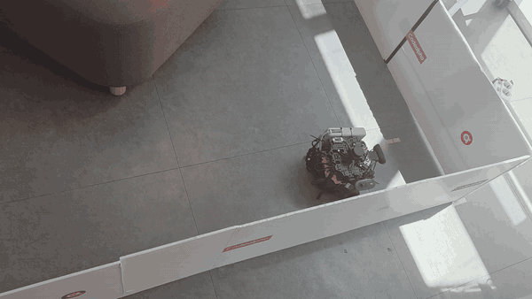<br />
        <sub>AMCL로 위치를 추정하며 Nav2 웨이포인트 구간을 자율 주행합니다</sub>
      </td>
      <td align="center" width="50%" valign="top">
        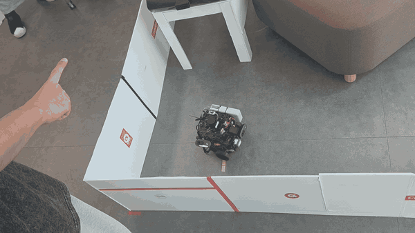<br />
        <sub>카메라가 제스처를 인식해 TurtleBot3의 이동과 회전을 제어합니다</sub>
      </td>
    </tr>
    <tr>
      <td align="center" width="50%" valign="top">
        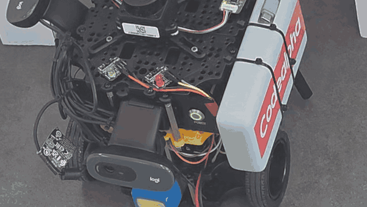<br />
        <sub>MFCC · SVM 이상 판정 결과를 빨간색 외부 LED로 표시합니다</sub>
      </td>
      <td align="center" width="50%" valign="top">
        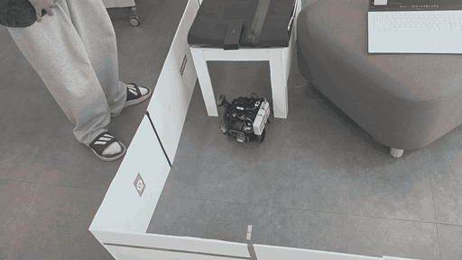<br />
        <sub>제스처 수동제어로 컨베이어 벨트 아래 협소 통로를 통과합니다</sub>
      </td>
    </tr>
    <tr>
      <td align="center" width="50%" valign="top">
        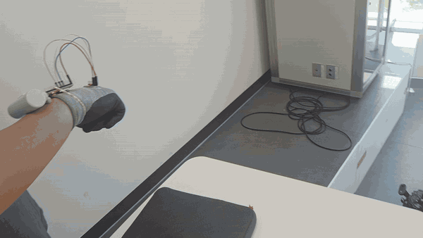<br />
        <sub>손목 기울기 입력을 Wi-Fi로 전달해 TurtleBot3를 수동 조작합니다</sub>
      </td>
      <td align="center" width="50%" valign="top">
        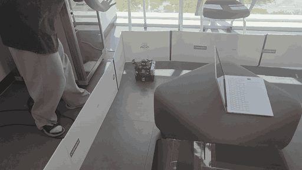<br />
        <sub>제스처로 자율주행 모드에 전환한 뒤 시작점으로 복귀합니다</sub>
      </td>
    </tr>
    <tr>
      <td align="center" width="50%" valign="top">
        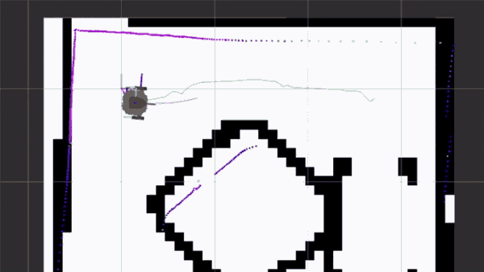
      </td>
      <td align="center" width="50%" valign="top">
        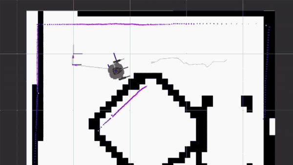
      </td>
    </tr>
  </table>
</div>

### 시연 영상

---

<div align="center">

<a href="https://www.youtube.com/watch?v=Mjf2t31ZWa0">
  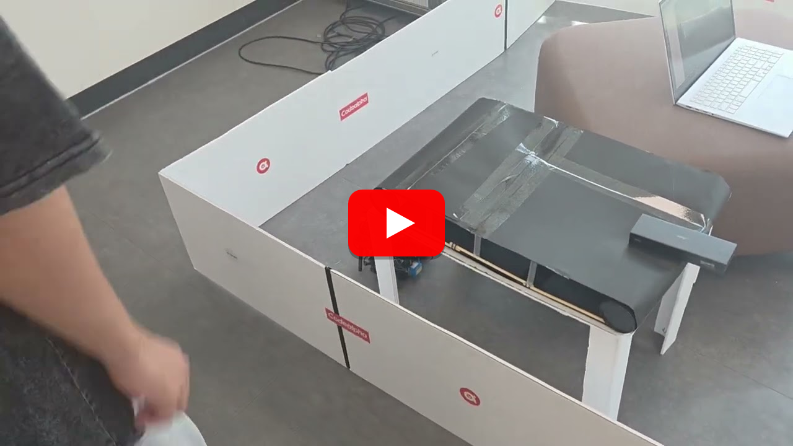
</a>

</div>

---

### 시스템 아키텍처

#### Hardware Architecture

TurtleBot3 Burger의 이동 플랫폼과 Jetson Orin Nano를 중심으로 LiDAR, Camera, Microphone, OpenCR, LED, IMU 장갑을 연결했습니다. 완성된 플랫폼 구성을 보여주는 블록 다이어그램이며 세부 회로도는 포함하지 않았습니다.

<p align="center">
  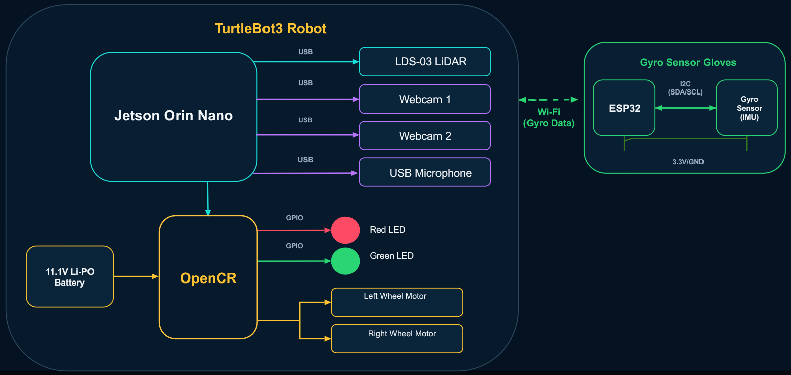
</p>

#### Software Architecture

ROS 2 Topic과 Action을 중심으로 Navigation, Patrol Control, Manual Control, Sound AI, Result/Alert 기능을 분리하고 필요한 Interface만 연결했습니다.

<p align="center">
  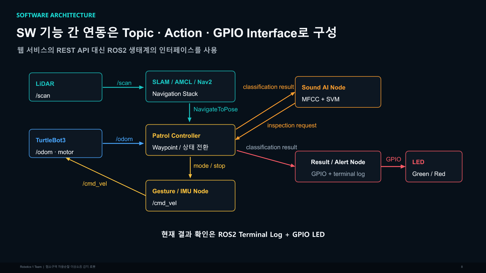
</p>

---

## 4. 시스템 구성

본 시스템은 **이동·연산 플랫폼**, **자율주행**, **음향 이상 감지**, **수동 보조제어**, **결과 출력**의 다섯 영역으로 구성됩니다.

### 하드웨어 구성

| 구성요소 | 역할 | 주요 연결 |
| --- | --- | --- |
| **TurtleBot3 Burger / OpenCR** | 차동구동 이동 플랫폼, Motor 및 Odometry 제어 | ROS 2, Dynamixel, USB |
| **Jetson Orin Nano** | ROS 2 Navigation, 음향 추론, 제스처 인식, 웹 서버 실행 | USB, Wi-Fi |
| **LDS-03 LiDAR** | 주변 거리 측정, 지도 작성, 위치 추정 | `/scan`, USB |
| **Dual Webcam / C270 내장 Microphone** | 두 대의 카메라를 이용한 손 제스처 영상과 설비음 입력 | USB, MJPEG |
| **Green / Red LED** | 정상·이상 판정 상태 표시 | OpenCR GPIO |
| **ESP32 + MPU6050 장갑** | 손목 자세 측정 및 수동 주행 명령 생성 | I2C, Wi-Fi UDP |
| **Game Controller** | 컨트롤러 모드의 수동 조작 입력 | USB, `/cmd_vel_joy` |

### 소프트웨어 및 데이터 흐름

| 계층 / 구성요소 | 역할 | 주요 Interface |
| --- | --- | --- |
| **SLAM Toolbox / AMCL / Nav2** | 지도 생성, 위치 추정, 경로 계획, Waypoint 이동 | `/scan`, `/odom`, `NavigateToPose`, `FollowWaypoints` |
| **Patrol Controller** | Waypoint와 운용 모드 관리, 자율·수동 구간의 제어권 전환 | Nav2 Action, mode state |
| **MediaPipe Gesture Engine** | 손 랜드마크 추론, 제스처 판정, 영상·상태 제공 | Flask `/cmd`, `/video_feed`, `/health` |
| **ROS 2 Control Bridge / MUX** | HTTP·UDP 입력을 `Twist`로 변환하고 활성 속도 소스를 선택 | `/cmd_vel_gesture`, `/cmd_vel_joy`, `/cmd_vel_glove`, `/cmd_vel_muxed` |
| **Sound Anomaly Node** | 마이크 입력, MFCC 특징 추출, SVM 정상·이상 분류 | `/sound_anomaly_node/state`, `/sound_anomaly_node/anomaly_probability` |
| **Result / Alert** | Terminal 상태 출력과 OpenCR LED 제어 | `/opencr_led_status` |
| **RViz2 / Web Browser** | 로봇 위치·경로 및 카메라·제어 상태 모니터링 | ROS 2 Visualization, MJPEG, JSON |

---

## 5. 개발 포인트

- **제어 입력 중재**: Nav2·손 제스처·조이스틱·IMU 장갑의 개별 `cmd_vel` Topic 중 하나만 MUX로 선택해 TurtleBot3에 전달
- **AUTO/MANUAL 상태 전환**: A-B Nav2, B-C 손 제스처, C-D 컨트롤러 제어 후 D에서 새 Nav2 Goal을 발행해 A로 복귀
- **음향 이상 판정 연동**: MFCC·SVM 판정 결과를 ROS 2 Topic과 OpenCR LED로 전달
- **제스처 제어 모듈화**: MediaPipe Flask 인식 서비스와 HTTP 상태를 `cmd_vel`로 변환하는 ROS 2 Bridge를 분리
- **무선 장갑 Fail-safe**: ESP32·MPU6050 자세 데이터를 20 Hz UDP로 전송하고 0.35초 수신 중단 시 정지
- **실기 운용 안정화**: Jetson 전원·USB·Headless Display·Odom/TF 재초기화와 Nav2 복귀 로직을 개선

---

## 6. 담당 역할

<table>
  <tr>
    <td width="50%" valign="top">
      <strong>이지용</strong><br /><br />
      - <strong>파트:</strong> 비전 / 제스처 제어<br />
      - <strong>담당:</strong> MediaPipe 기반 손 제스처 수동제어와 웹 모니터링 구현<br />
      - <strong>주요 기능:</strong> 카메라 입력, 손 랜드마크 분석, 제스처 명령 변환, Flask 영상·상태 API 제공<br />
      - <strong>비고:</strong> 손 미검출 시 정지하는 Fail-safe와 협소 구간 수동주행 지원
    </td>
    <td width="50%" valign="top">
      <strong>은대영</strong><br /><br />
      - <strong>파트:</strong> 음향 AI / 이상음 감지<br />
      - <strong>담당:</strong> 설비음 수집부터 정상·이상 판정까지의 음향 분석 기능 구현<br />
      - <strong>주요 기능:</strong> 마이크 입력, 음원 전처리, MFCC 특징 추출, SVM 분류, 판정 결과 Topic 발행<br />
      - <strong>비고:</strong> 기어박스 음향 데이터 학습·평가 및 Terminal·LED 출력 연동
    </td>
  </tr>
  <tr>
    <td width="50%" valign="top">
      <strong>장재호</strong><br /><br />
      - <strong>파트:</strong> 자율주행 / 순찰 제어<br />
      - <strong>담당:</strong> SLAM·Nav2 기반 지도 작성, 위치 추정 및 Waypoint 순찰 구현<br />
      - <strong>주요 기능:</strong> SLAM Toolbox 지도 생성, AMCL 위치 추정, Waypoint 관리, 자율주행 및 순찰 복귀<br />
      - <strong>비고:</strong> Odom·TF 및 주행 좌표를 조정하고 실제 주행 환경 안정화
    </td>
    <td width="50%" valign="top">
      <strong>김한민</strong><br /><br />
      - <strong>파트:</strong> 임베디드 / 통합 제어<br />
      - <strong>담당:</strong> ESP32·MPU6050 IMU 장갑 제작 및 다중 제어 입력 통합<br />
      - <strong>주요 기능:</strong> Roll·Pitch 측정, Wi-Fi UDP 전송, 장갑 주행 명령 변환, 제어 MUX 및 AUTO/MANUAL 전환<br />
      - <strong>비고:</strong> 통신 중단 시 정지 로직과 전체 운용 시나리오 통합 테스트
    </td>
  </tr>
</table>

---

## 7. 기술 스택

| 구분 | 기술 및 도구 |
| --- | --- |
| **Robot Platform** | TurtleBot3 Burger, Jetson Orin Nano, OpenCR, LDS-03 LiDAR |
| **Robotics / Middleware** | ROS 2 Humble, SLAM Toolbox, AMCL, Nav2, RViz2, `rclpy`, `rclcpp` |
| **Perception / Vision** | MediaPipe Hand Landmarker, OpenCV, Dual Camera Pipeline |
| **Acoustic AI** | MFCC, SVM, scikit-learn, librosa, NumPy, SoundDevice, Joblib |
| **Application / Monitoring** | Flask, MJPEG Streaming, HTTP/JSON API |
| **Embedded / Communication** | ESP32, MPU6050, Arduino, I2C, Wi-Fi UDP, GPIO |
| **Languages / Build** | Python, C++, Arduino C++, Bash, CMake, ament, colcon |

---

## 8. 프로젝트 의의

AAIR의 의미는 TurtleBot3에 개별 기능을 하나씩 붙인 데 있지 않습니다. **환경 인지와 이동, 설비음 판정, 작업자의 수동 개입, 결과 알림을 실제 운용 순서에 맞춰 하나의 로봇 시스템으로 연결했다는 점**에 있습니다.

작업자가 협소·위험 구역에 반복적으로 진입하고 경험적인 청감에 의존하던 1차 점검을, 로봇의 지정 경로 순찰과 일관된 음향 판정으로 보조했습니다. 또한 모든 구간을 자율주행만으로 처리한다고 가정하지 않고, 예외 상황에서 작업자가 제스처나 IMU 장갑으로 개입한 뒤 다시 자율주행으로 복귀하는 현실적인 운용 구조를 구현했습니다.

개발 과정에서는 Navigation, AI, Embedded, Web 기술을 각각 구현하는 데 그치지 않고 전원, USB 장치, Odom/TF, 입력 충돌과 같은 실제 하드웨어 통합 문제를 해결했습니다. 이 과정을 통해 로봇 프로젝트의 완성도는 단일 알고리즘보다 **여러 기능을 안정적으로 연결하고 끝까지 동작시키는 시스템 통합**에서 결정된다는 점을 확인했습니다.

---

## 9. 아쉬웠던 점 및 개선 방향

- **현장 데이터 확장**: 설비별 정상·이상 음원을 다시 수집하고 재학습하여 실제 환경에서의 판정 신뢰도 개선
- **점검 이력 관리**: 로봇 Pose, Timestamp, 판정 결과를 DB에 저장하고 Dashboard에서 조회하는 기능 추가
- **장시간 운용 검증**: 반복 순찰, 제어권 전환, 위치 추정 복구를 장시간 조건에서 검증하고 Recovery Logic 보완
- **배포 환경 정리**: 기존 시연 장비의 절대경로를 현재 저장소 구조에 맞게 수정하고 재현 가능한 실행 절차 제공
- **Firmware 보존**: 최종 시연에 사용한 OpenCR LED Firmware 원본을 확보하고 Build·Upload 절차 문서화


### 9-1. 저장소 구조

```text
.
├── src/                           ROS 2 패키지
├── mediapipe_gesture_control/     MediaPipe 제스처 인식 Flask 애플리케이션
├── firmware/                      ESP32 장갑 및 OpenCR 관련 자료
├── scripts/                       최종 시연·기능별 실행 및 설치 스크립트
├── docs/                          프로젝트 문서와 README 이미지
└── tools/opencr_updater/          OpenCR 업데이트 도구와 보관 바이너리
```

| 경로 | 주요 내용 |
| --- | --- |
| [`src/turtlebot3_inspection_bringup`](src/turtlebot3_inspection_bringup) | TurtleBot3, Nav2, Sound AI 통합 Launch와 지도·RViz 설정 |
| [`src/turtlebot3_inspection_control`](src/turtlebot3_inspection_control) | 속도 MUX, 제스처 Bridge, Wi-Fi 장갑, Waypoint Handoff |
| [`src/turtlebot3_waypoint_patrol`](src/turtlebot3_waypoint_patrol) | A-B-C-D-A Waypoint 순찰 Node |
| [`src/sound_anomaly_node`](src/sound_anomaly_node) | MFCC·SVM 학습·추론 코드와 ROS 2 Sound Anomaly Node |
| [`mediapipe_gesture_control`](mediapipe_gesture_control) | MediaPipe Hand Landmarker, Camera Pipeline, Flask Server |
| [`firmware/esp32_mpu6050_glove`](firmware/esp32_mpu6050_glove) | ESP32·MPU6050 Wi-Fi UDP 장갑 Firmware |
| [`scripts/final_demo`](scripts/final_demo) | 최종 비-Safety 통합 시연 실행 Chain |

> 이 저장소는 당시 여러 Workspace에 흩어진 결과물을 역할별로 재배치한 정리본입니다. 기존 실행 파일에는 시연 장비의 절대경로가 남아 있어 현재 구조에서의 Build와 실행은 별도 확인이 필요합니다.

프로젝트의 최종 동작 흐름은 [`docs/PROJECT_CONTEXT.md`](docs/PROJECT_CONTEXT.md), 제스처와 제어권 전환은 [`mediapipe_gesture_control/docs/GESTURES.md`](mediapipe_gesture_control/docs/GESTURES.md), 음향 감지 검증 기록은 [`src/sound_anomaly_node/docs/VALIDATION.md`](src/sound_anomaly_node/docs/VALIDATION.md)에서 확인할 수 있습니다.
